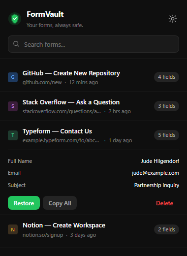
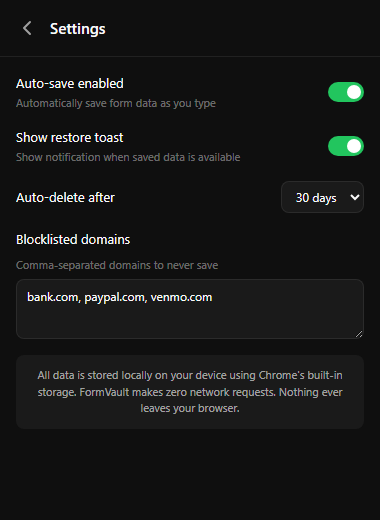
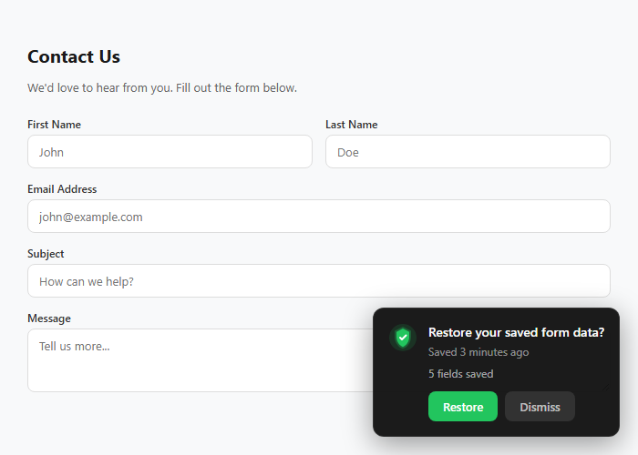

<p align="center">
  
</p>

<h1 align="center">FormVault</h1>

<p align="center">
  <strong>Your forms, always safe.</strong><br>
  Auto-save and restore web form data locally — no accounts, no cloud, no data ever leaving your browser.
</p>

<p align="center">
  <a href="LICENSE"></a>
  <a href="https://developer.chrome.com/docs/extensions/develop/migrate/what-is-mv3"></a>
  
  
</p>

---

Ever lost a long form submission to a page crash, accidental refresh, or back-button mishap? FormVault silently saves your form inputs as you type and offers one-click restore when you return — entirely offline, with zero data leaving your machine.

<br>

<p align="center">
  
  &nbsp;&nbsp;&nbsp;
  
</p>

<p align="center">
  
</p>

## Features

- **Auto-Save** — Saves form data every 3 seconds after your last keystroke, no manual action needed
- **One-Click Restore** — Non-intrusive toast notification offers instant recovery when revisiting a page
- **React & SPA Compatible** — MutationObserver detects dynamically added fields; native value setters work with React controlled components
- **Privacy-First** — 100% local storage, zero network requests, zero analytics, zero telemetry
- **Sensitive Field Detection** — Automatically skips passwords, credit card numbers, SSNs, and other sensitive inputs
- **Search & Browse** — Full-text search across all saved forms by title, URL, or field content
- **Configurable Retention** — Auto-delete after 7, 30, or 90 days (or keep forever)
- **Domain Blocklist** — Exclude specific domains from auto-saving (banking sites blocked by default)
- **Shadow DOM Isolation** — All injected UI is fully isolated from host page styles
- **Storage Management** — Automatic quota checks with smart pruning of oldest entries when storage runs low
- **Live Updates** — Popup refreshes in real-time when forms are saved from other tabs

## Installation

1. Clone or download this repository:
   ```bash
   git clone https://github.com/TiltedLunar123/FormVault.git
   ```
2. Open Chrome and go to `chrome://extensions/`
3. Enable **Developer mode** (toggle in the top-right corner)
4. Click **Load unpacked** and select the `FormVault` folder
5. The green shield icon will appear in your toolbar — you're all set

## How It Works

| Step | What happens |
|------|-------------|
| **Auto-save** | When you type in any form field, FormVault debounces your input and saves all non-sensitive field data to `chrome.storage.local` after 3 seconds of inactivity. |
| **Page key** | Each page gets a stable key derived from its URL (volatile query params like UTM tags are stripped, form-identifying params are kept) so saves persist across refreshes. |
| **Restore toast** | When you revisit a page with saved data, a Shadow DOM-isolated toast appears offering one-click restore. Fields are matched by CSS selector, `name` attribute, or XPath fallback. |
| **Flush on exit** | Data is flushed immediately on `beforeunload` and `visibilitychange` to prevent loss when closing a tab or switching away. |
| **Cleanup** | A background alarm prunes expired entries every 24 hours based on your retention setting. |

## Project Structure

```
FormVault/
├── manifest.json        # Extension manifest (MV3)
├── background.js        # Service worker — cleanup scheduling, badge updates
├── content.js           # Content script — form detection, auto-save, restore toast
├── popup.html           # Extension popup UI
├── popup.js             # Popup logic — form list, search, settings
├── popup.css            # Popup styles (dark theme)
├── privacy.html         # Privacy policy page
├── utils/
│   └── storage.js       # Shared storage helpers (CRUD, settings, quota management)
├── icons/
│   ├── icon16.png
│   ├── icon48.png
│   └── icon128.png
└── screenshots/         # README images
```

## Privacy

FormVault is built with privacy as a core principle:

- All data is stored locally using `chrome.storage.local`
- The extension makes **zero network requests** — no fetch, no XMLHttpRequest, no external scripts
- No analytics, no tracking, no telemetry of any kind
- Sensitive fields (passwords, credit cards, SSNs) are never saved
- Banking and financial sites are excluded by default
- User-configurable domain blocklist for additional control

See the full [privacy policy](privacy.html).

## Roadmap

- [ ] **iframe Support** — Save and restore form data inside iframes
- [ ] **Cross-Browser Port** — Firefox (Manifest V3) and Edge compatibility
- [ ] **Export / Import** — Export saved forms as JSON for backup and migration
- [ ] **Per-Site Settings** — Fine-grained control over which sites to auto-save
- [ ] **Keyboard Shortcuts** — Quick restore via configurable hotkey

## Contributing

Contributions are welcome! Please see [CONTRIBUTING.md](CONTRIBUTING.md) for guidelines.

## License

[MIT](LICENSE)
