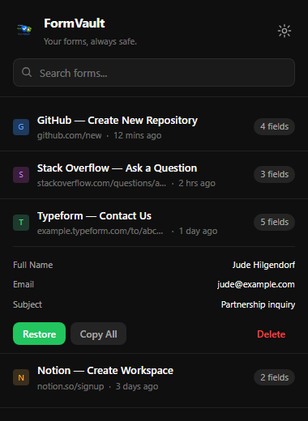
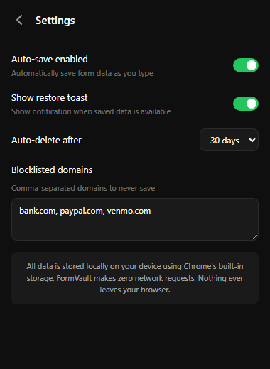
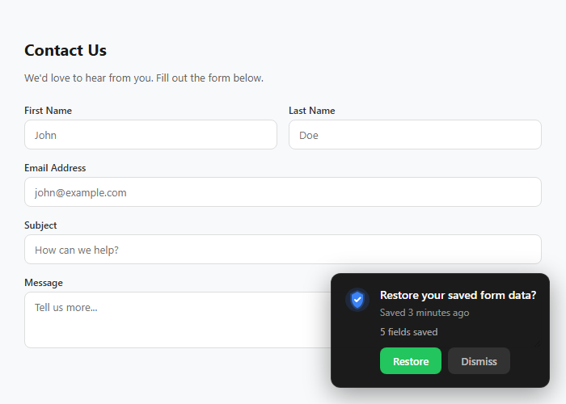

<p align="center">
  
</p>

# FormVault

A Chrome extension that saves what you type into web forms, locally, so a crash or a
stray back button does not eat twenty minutes of work.

[](LICENSE)
[](https://developer.chrome.com/docs/extensions/develop/migrate/what-is-mv3)

<p align="center">
  
  &nbsp;&nbsp;&nbsp;
  
</p>

<p align="center">
  
</p>

## How it works

You type. Three seconds after you stop, the field values on the page get written to
`chrome.storage.local` under a key derived from the URL. Volatile query parameters like
UTM tags are stripped when building that key and form-identifying ones are kept, so the
save survives a refresh but does not leak across unrelated pages.

Come back to that page later and a toast offers to put the values back. Fields are
matched by CSS selector first, then `name`, then an XPath fallback, because any one of
those alone breaks on a real site.

Saves are also flushed on `beforeunload` and `visibilitychange`, which is what catches
the tab you close without thinking about it. A background alarm prunes expired entries
once a day.

Two things that took the longest to get right:

**Dynamic forms.** A MutationObserver picks up fields added after page load, and writes
go through the native value setter rather than assigning to `.value`, which is the only
way React controlled components notice the change at all.

**Not interfering with the page.** The restore toast lives in a closed shadow root, so
the host page cannot style it and it cannot style the host page.

## What it will not save

Anything matching the sensitive-field pattern is skipped before it ever reaches storage:
passwords, SSNs, card numbers, CVV, expiry, routing and account numbers, PINs. Fields
declaring an `autocomplete` of `cc-*`, `new-password` or `current-password` are skipped
on that basis too, regardless of what they are named.

On top of that, the content script is not injected at all on twelve financial and
government domains: Bank of America, Chase, Wells Fargo, Citi, US Bank, Capital One,
PayPal, Venmo, Stripe, IRS, SSA and login.gov. That is an `exclude_matches` list in the
manifest, so it is not a check the extension could get wrong at runtime. It never loads
there.

The user blocklist is a third, separate thing, and it starts empty. Add whatever else
you want skipped under Settings.

## Privacy

FormVault sends nothing anywhere. There is no fetch, no XMLHttpRequest, no remote
script, no analytics and no telemetry in the source, and your form data stays in
`chrome.storage.local` on your machine.

One honest caveat, because "zero network requests" is not quite true and I would rather
say so than have you find it in DevTools: the popup lists each saved form with the
site's favicon, and it does that by pointing an `` at the icon URL. Opening the
popup therefore makes your browser fetch those icons from sites you have already
visited. No data of yours goes out with it, and no third party is involved, but it is a
request and it is caused by this extension. Tracked in
[#17](https://github.com/TiltedLunar123/FormVault/issues/17); the fix is to inline the
icons at save time.

Full text in [privacy.html](privacy.html).

## Settings

Retention is 7, 30, or 90 days, or never delete. Default is 30. Auto-save and the
restore toast can each be switched off. The blocklist takes a comma-separated list of
domains.

When storage runs low the oldest entries get pruned automatically rather than saves
starting to fail silently.

## Install

Not on the Web Store yet, so load it unpacked:

```bash
git clone https://github.com/TiltedLunar123/FormVault.git
```

Then open `chrome://extensions/`, turn on Developer mode, click Load unpacked, and pick
the folder. The green shield shows up in the toolbar.

## Layout

```
manifest.json     MV3 manifest
background.js     service worker: cleanup alarm, badge counts
content.js        form detection, auto-save, restore toast
popup.html/js/css the popup
utils/storage.js  storage helpers, settings, quota handling
privacy.html      privacy policy
```

## Tests

```bash
npm install
npm test
```

Jest with a mocked `chrome` API, covering the storage helpers, the popup logic, the
content script's field detection, and the service worker.

## Still to do

Firefox and Edge ports are the main one. After that, saving inside iframes, JSON
export for backup, and per-site settings instead of one global blocklist.

## Licence

[MIT](LICENSE).
